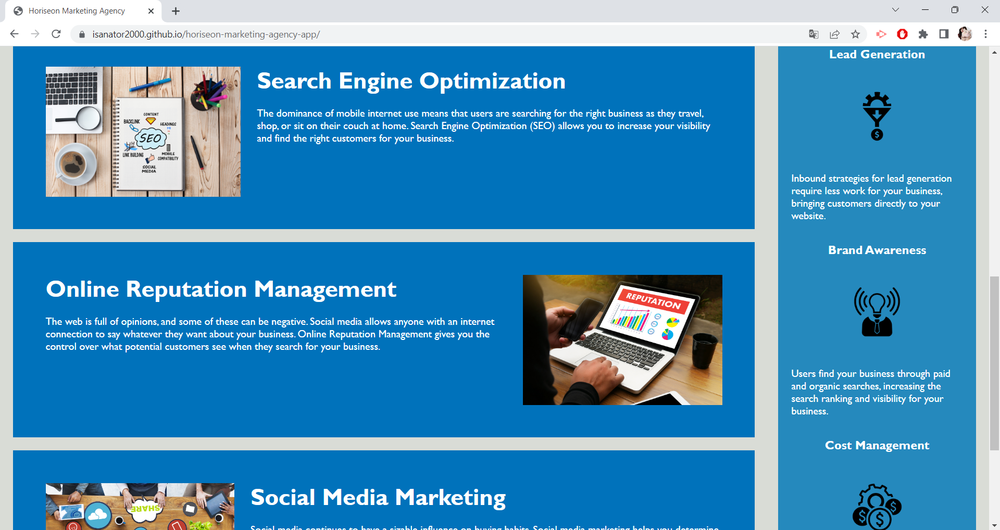
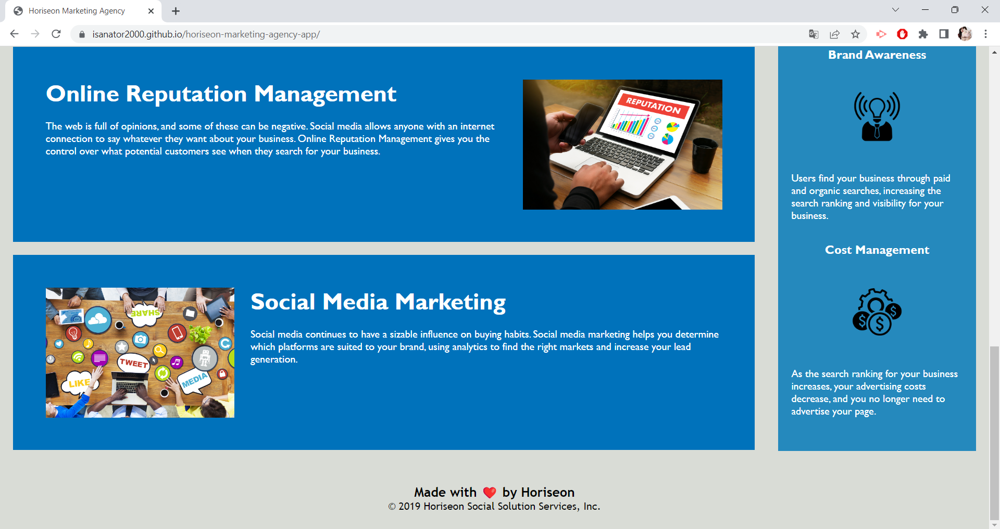

# Horiseon Marketing Agency application

## Description

For this assignment, I refactored code for Horiseon, a marketing agency company. Following the requirements that I was given, I made their page meet accessibility standards by doing the following: 
I used semantic HTML  elements and organized them so that they would follow a logical structure. I also cleaned up the styling sheet by making sure there weren't any unnecessary selectors. 
I added accessible alt text to the images, made sure the headings were in order and then added a descriptive title for the page. 

## Usage

To navigate through this webpage, you can click on the titles displayed in the header bar. Doing so will take you to the corresponding section where you can read some information. 

[Horiseon marketing agency webpage] (https://isanator2000.github.io/horiseon-marketing-agency-app/)

## Notes
Although I cannot properly credit them because I do not have any links to their GitHub profiles or anything of the sort, I would like to thank my tutor Patrick Lake for guiding me through this assignment, as well as Daniel and Maverick, AskBCS Learning Assistants that helped me sort out some issues encountered while trying to deploy the page. 